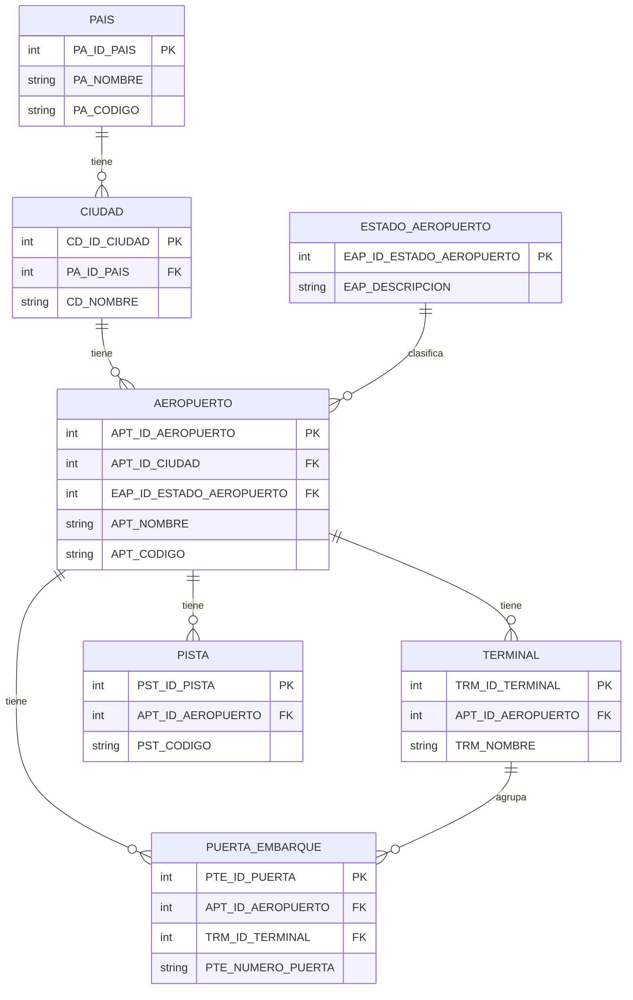
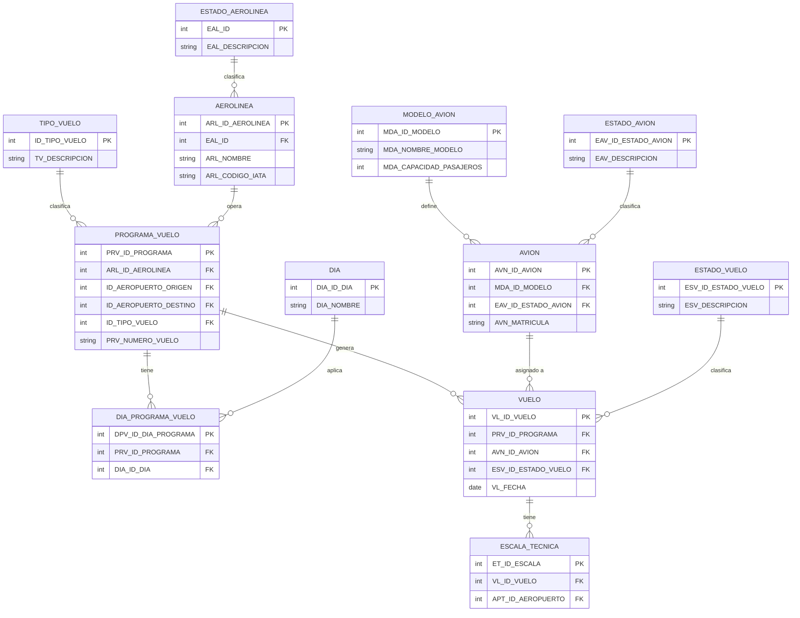
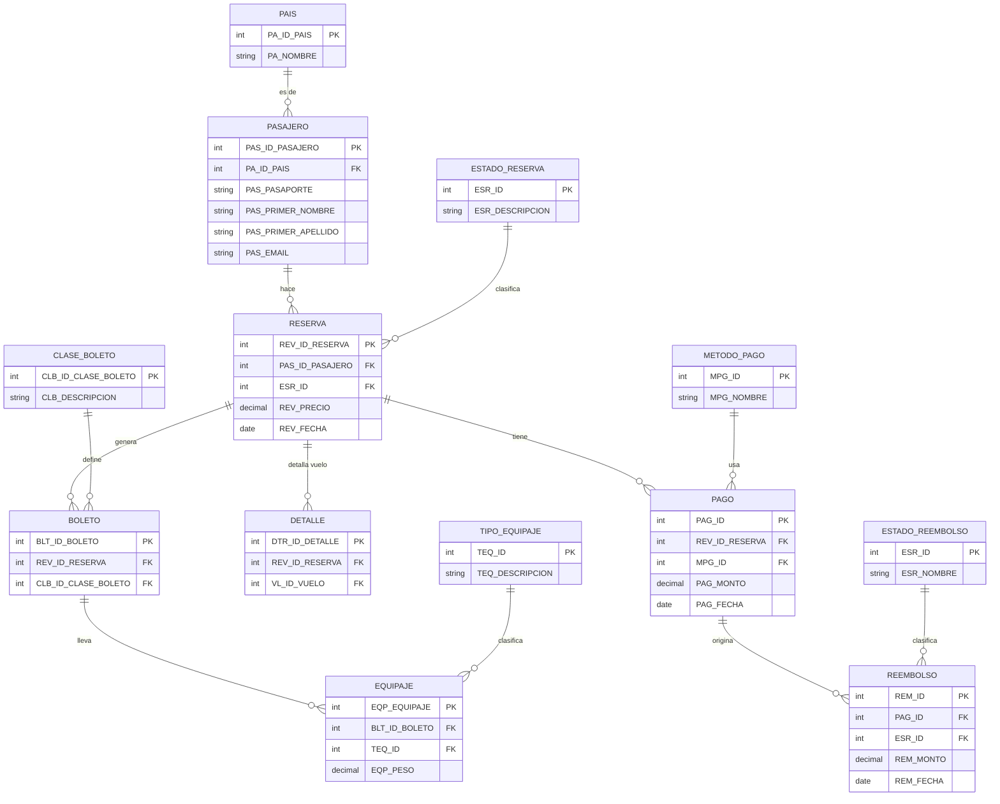
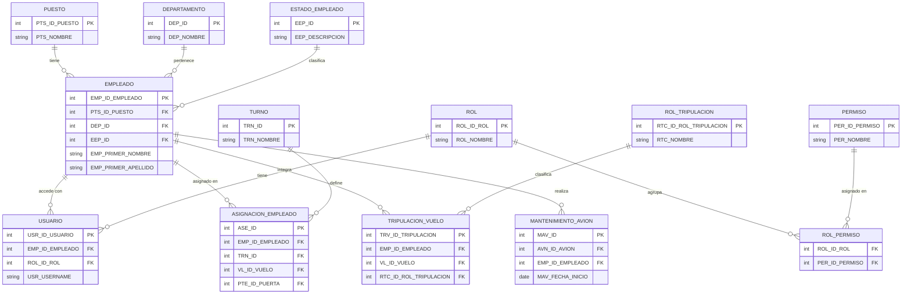

# SGA – Diagrama de Relaciones entre Entidades

> Renderiza este archivo en VS Code con la extensión **Markdown Preview Mermaid Support**,
> o pégalo en [mermaid.live](https://mermaid.live).

---

## 🗂️ Módulo 1 – Geografía y Aeropuertos

---

## ✈️ Módulo 2 – Flota y Vuelos

---

## 👥 Módulo 3 – Pasajeros y Reservas

---

## 🛬 Módulo 4 – Operaciones de Vuelo (Pasajero ↔ Vuelo)

```mermaid
erDiagram
    PASAJERO {
        int PAS_ID_PASAJERO PK
        string PAS_PASAPORTE
        string PAS_PRIMER_NOMBRE
    }
    VUELO {
        int VL_ID_VUELO PK
        date VL_FECHA
    }
    BOLETO {
        int BLT_ID_BOLETO PK
        int REV_ID_RESERVA FK
    }
    ASIENTO {
        int ASI_ID_ASIENTO PK
        int AVN_ID_AVION FK
        int CLB_ID_CLASE_BOLETO FK
        string ASI_NUMERO
    }
    ESTADO_ASIENTO {
        int EAS_ID PK
        string EAS_NOMBRE
    }
    ASIGNACION_ASIENTO {
        int ASA_ID_ASIGNACION PK
        int BLT_ID_BOLETO FK
        int ASI_ID_ASIENTO FK
        int VL_ID_VUELO FK
        int EAS_ID FK
    }
    ESTADO_CHECKIN {
        int ECK_ID_ESTADO PK
        string ECK_NOMBRE
    }
    CHECKIN {
        int CHK_ID PK
        int PAS_ID_PASAJERO FK
        int VL_ID_VUELO FK
        int ECK_ID_ESTADO FK
        datetime CHK_FECHA_CHECKIN
    }
    ESTADO_ABORDAJE {
        int EAB_ID_ESTADO_ABORDAJE PK
        string EAB_NOMBRE
    }
    PASAJERO_VUELO {
        int ID_PASAJERO_VUELO PK
        int PAS_ID_PASAJERO FK
        int VL_ID_VUELO FK
        int EAB_ID_ESTADO_ABORDAJE FK
    }
    ESTADO_ASIGNACION {
        int EAS_ID_ESTADO_ASIGNACION PK
        string EAS_DESCRIPCION
    }
    ASIGNACION_PUERTA {
        int ASP_ID_ASIGNACION PK
        int VL_ID_VUELO FK
        int PTE_ID_PUERTA FK
        int EAS_ID_ESTADO_ASIGNACION FK
    }
    TIPO_EVENTO {
        int TE_ID PK
        string TE_DESCRIPCION
    }
    HISTORIAL_VUELO {
        int HVL_ID_HISTORIAL PK
        int VL_ID_VUELO FK
        int TE_ID FK
        int ESV_ESTADO_PREVIO FK
        int ESV_ESTADO_ACTUAL FK
    }

    PASAJERO           ||--o{ CHECKIN             : "realiza"
    PASAJERO           ||--o{ PASAJERO_VUELO      : "aborda"
    VUELO              ||--o{ CHECKIN             : "en"
    VUELO              ||--o{ PASAJERO_VUELO      : "tiene"
    VUELO              ||--o{ ASIGNACION_PUERTA   : "usa"
    VUELO              ||--o{ HISTORIAL_VUELO     : "registra"
    BOLETO             ||--o{ ASIGNACION_ASIENTO  : "ocupa"
    ASIENTO            ||--o{ ASIGNACION_ASIENTO  : "asignado en"
    ESTADO_ASIENTO     ||--o{ ASIGNACION_ASIENTO  : "clasifica"
    ESTADO_CHECKIN     ||--o{ CHECKIN             : "clasifica"
    ESTADO_ABORDAJE    ||--o{ PASAJERO_VUELO      : "clasifica"
    ESTADO_ASIGNACION  ||--o{ ASIGNACION_PUERTA   : "clasifica"
    TIPO_EVENTO        ||--o{ HISTORIAL_VUELO     : "clasifica"
```

---

## 👨‍✈️ Módulo 5 – Personal y Tripulación

---

## 🔗 Módulo 6 – Vista General de Relaciones Clave

```mermaid
flowchart TD
    subgraph CAT["📋 Catálogos"]
        PAIS
        CIUDAD
        CLASE_BOLETO
        TIPO_EQUIPAJE
        PUESTO
        DEPARTAMENTO
        ROL
        PERMISO
        TURNO
        METODO_PAGO
    end

    subgraph INFRA["🏢 Infraestructura"]
        AEROPUERTO
        TERMINAL
        PUERTA_EMBARQUE
        PISTA
    end

    subgraph FLOTA["✈️ Flota"]
        MODELO_AVION
        AVION
        ASIENTO
    end

    subgraph VUELOS["🛫 Vuelos"]
        AEROLINEA
        PROGRAMA_VUELO
        VUELO
        ESCALA_TECNICA
        HISTORIAL_VUELO
        ASIGNACION_PUERTA
        ASIGNACION_PISTA
    end

    subgraph PASAJEROS["👥 Pasajeros"]
        PASAJERO
        RESERVA
        BOLETO
        DETALLE
        EQUIPAJE
        CHECKIN
        PASAJERO_VUELO
        ASIGNACION_ASIENTO
    end

    subgraph FINANZAS["💰 Finanzas"]
        PAGO
        REEMBOLSO
    end

    subgraph PERSONAL["👨‍✈️ Personal"]
        EMPLEADO
        USUARIO
        ROL_PERMISO
        TRIPULACION_VUELO
        ASIGNACION_EMPLEADO
        MANTENIMIENTO_AVION
    end

    subgraph SEGURIDAD["🔒 Seguridad"]
        OBJETO_PERDIDO
        ARRESTO
    end

    PAIS --> CIUDAD --> AEROPUERTO
    AEROPUERTO --> TERMINAL --> PUERTA_EMBARQUE
    AEROPUERTO --> PISTA

    AEROLINEA --> PROGRAMA_VUELO --> VUELO
    AVION --> VUELO
    MODELO_AVION --> AVION
    AVION --> ASIENTO

    PASAJERO --> RESERVA --> BOLETO
    RESERVA --> DETALLE --> VUELO
    BOLETO --> EQUIPAJE
    BOLETO --> ASIGNACION_ASIENTO --> ASIENTO

    PASAJERO --> CHECKIN --> VUELO
    PASAJERO --> PASAJERO_VUELO --> VUELO

    RESERVA --> PAGO --> REEMBOLSO
    VUELO --> ASIGNACION_PUERTA --> PUERTA_EMBARQUE
    VUELO --> ASIGNACION_PISTA --> PISTA
    VUELO --> HISTORIAL_VUELO

    EMPLEADO --> TRIPULACION_VUELO --> VUELO
    EMPLEADO --> MANTENIMIENTO_AVION --> AVION
    EMPLEADO --> ASIGNACION_EMPLEADO
    EMPLEADO --> USUARIO --> ROL --> ROL_PERMISO --> PERMISO

    PASAJERO --> OBJETO_PERDIDO
    PASAJERO --> ARRESTO
```

